# Make Oceanis Great Again
A click-puzzle game about political staire, gameplay ideas mainly from the game Replica. This game is just a demo and has not finished yet.

I spent hours and hours of time to make smart-phone like ui and phone call & text system, as well as debugging (the most time consuming part). But I still have questions about the story and gameplay part, with overwhelming school work, I had to temporarily pause the developement of this game. I truly wish I could finish this game someday in the future.

Demo video: https://youtu.be/ZwX5cpQtzLs

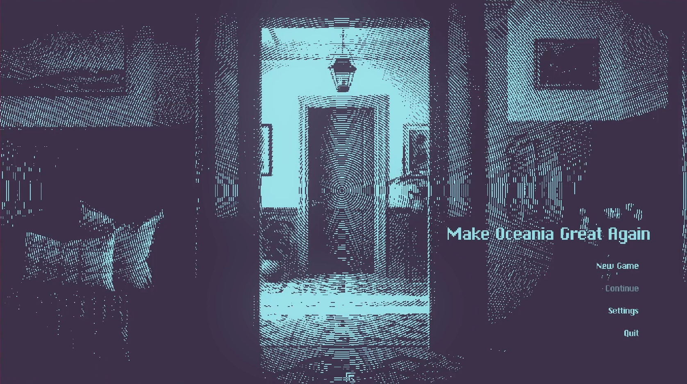
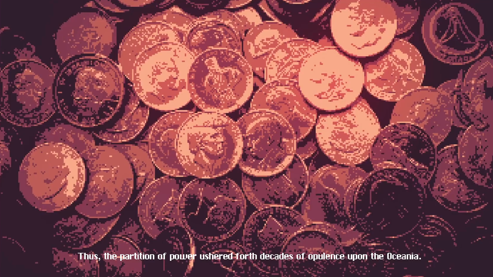
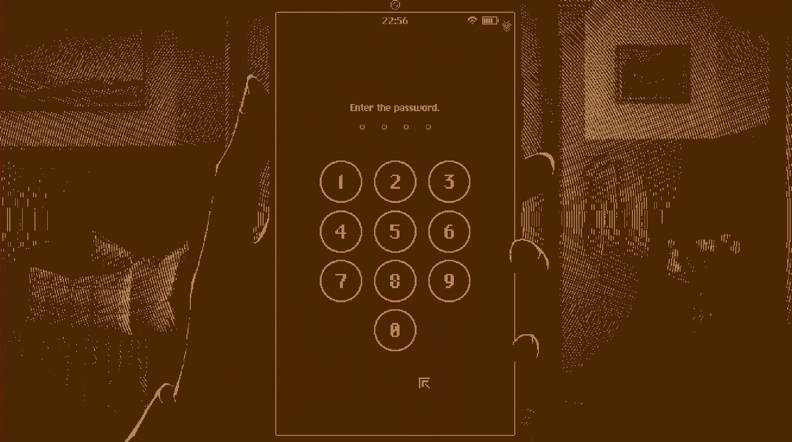
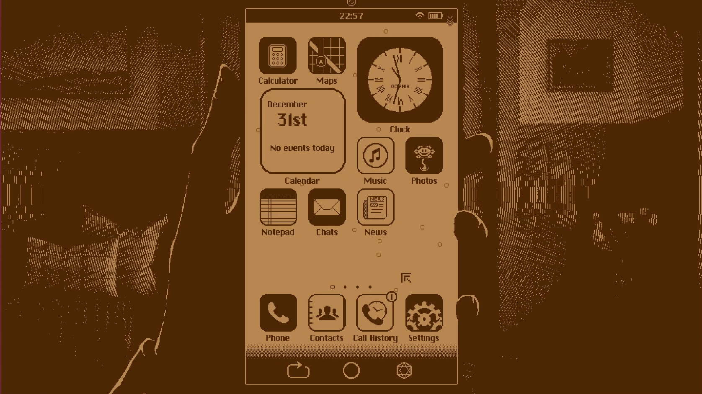
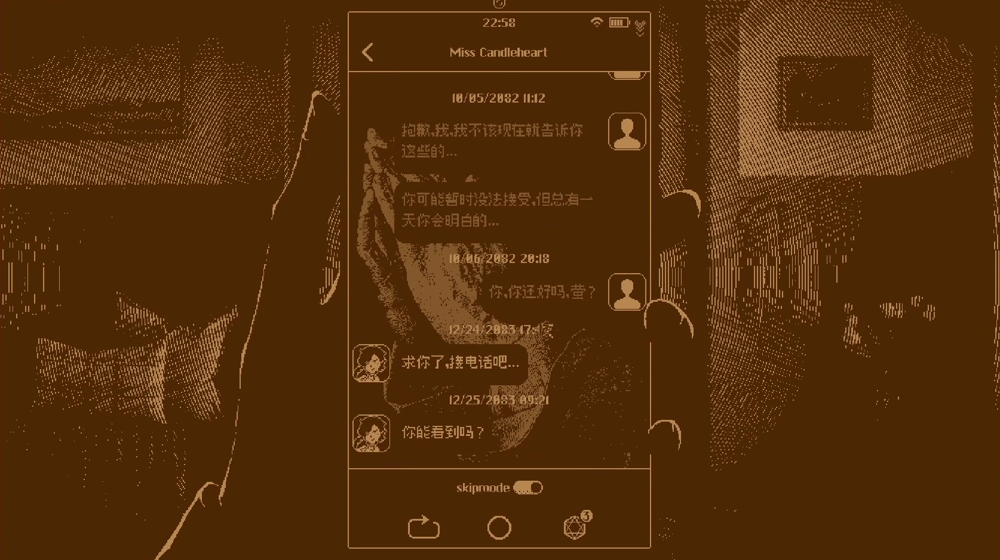
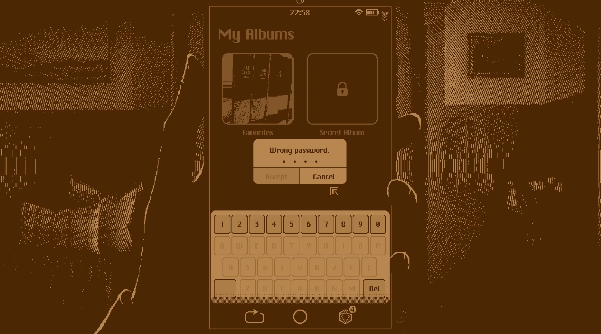
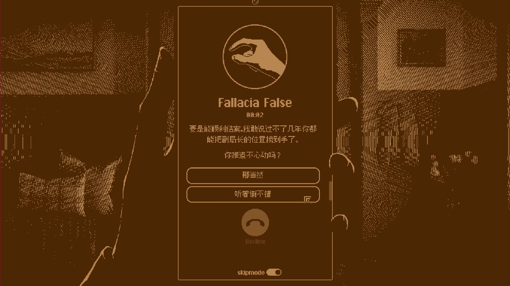
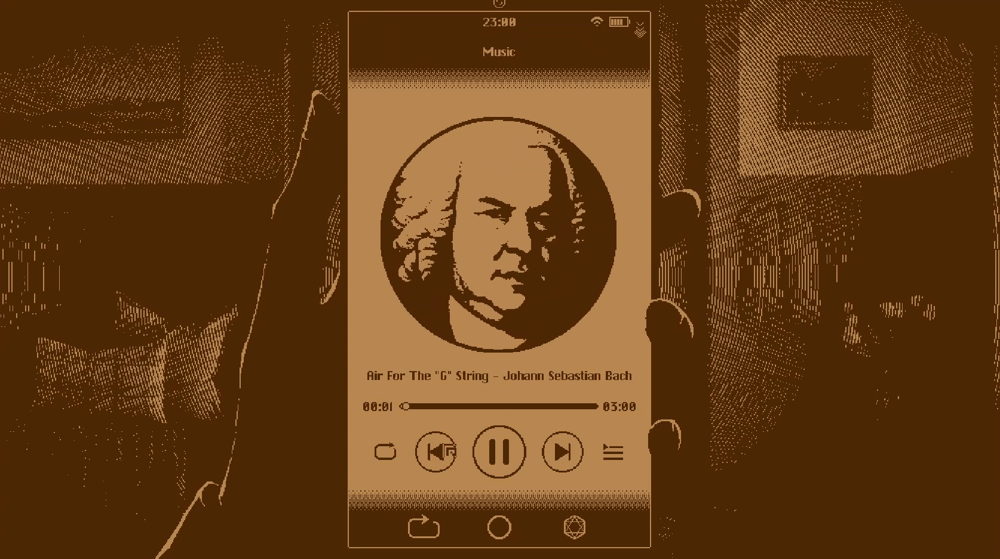
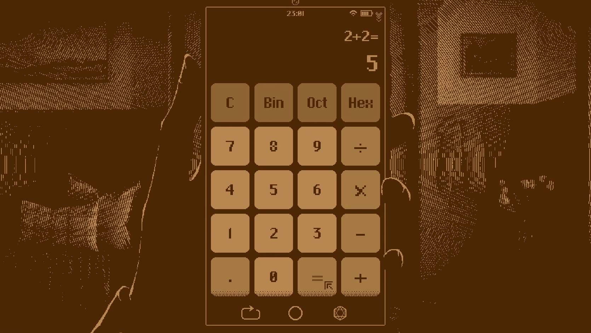
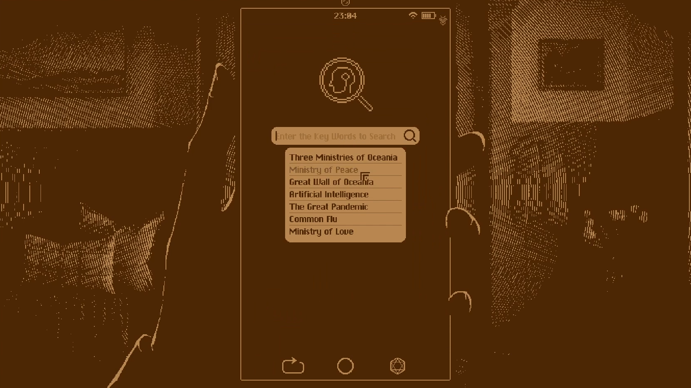
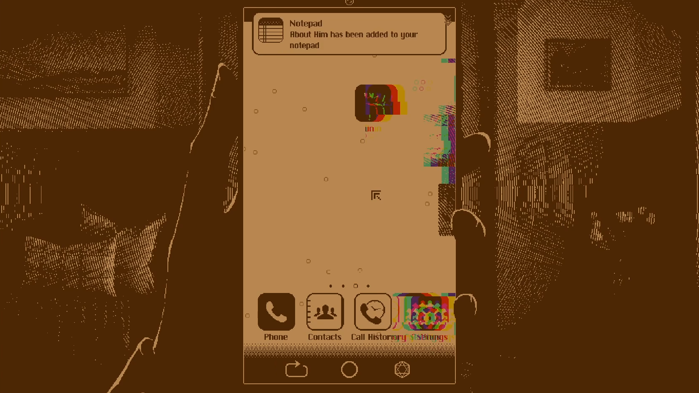
